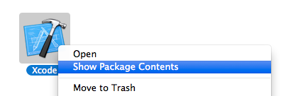
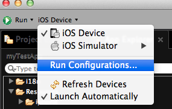
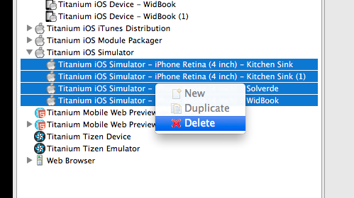
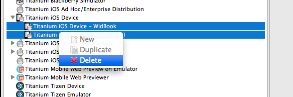
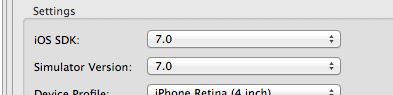
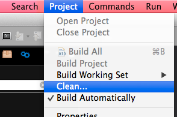

# Titanium fix to 3.1.x

## Description

The steps below will help you solve the problem of not being able to use more SDK 3.1.X in Titanium after updating it to 3.2.0 SDK.

After upgrading Xcode and Titanium, it works correctly if your project using the SDK 3.2.0.GA, but if you have some older project that uses the SDK 3.1.X, and you can not (or will not) upgrade it to SDK 3.2.0, probably should have seen this error:

	[ERROR] : Invalid "--ios-version" value "7.0.3"

	Accepted values:
	7.0
	6.1

	For help, run: titanium help build
	[ERROR] : Invalid "--sim-version" value "7.0.3".

This manual will help you correct the error, but I recommend that once you have a time, refresh your project to be compatible with the 3.2.0 SDK, because it is much better and faster.

## IMPORTANT

### Downgrade?

NO! Some people are downgrading the Titanium Client to solve this problem, but in this case, can not use the 3.2.0 SDK.

### Change Titanium?

NO! To maintain the integrity of the Client and Titanium Studio, and can update the SDK's

### Pros
You can use the SDK 3.2.X and 3.1.X's smoothly.

### Cons
Occupy approximately 4Gb more on your hard (A small price to pay for a great benefit).

### What is the error?
This error happens because we have Xcode installed with the SDK 7.0.3 and Titanium Client 3.1.X does not understand the last digit "3", for it is the latest version 7.0.

### What will we do?
Simple, create version 7.0 of the SDK for Xcode and Simulator.

## LET's GO

First, close Titanium and Xcode if it's open.

### Creating SDK 7.0

1 - Open **Applications** folder

2 - Find **Xcode** and click on it with the **control** key on the keyboard pressed

3 - Select the option **Show Package Contents**

4 - Open the folder **Contents/Developer/Platforms/iPhoneOS.platform/Developer/SDKs**

5 - Now you should see the folder **iPhoneOS7.0.sdk**, rename it to **iPhoneOS7.0.3.sdk**

6 - Duplicate the **iPhoneOS7.0.3.sdk** folder, and name it **iPhoneOS7.0.sdk** for this new folder

7 - Open **iPhoneOS7.0.sdk/System/Library/CoreServices/** folder

8 - Edit **SystemVersion.plist**, changing the value for key **ProductVersion** from 7.0.3 to 7.0

9 - Save and close

### Creating Simulator 7.0

1 - Using the same above steps (1-3) to display the **Contents** of **Xcode**

2 - Open the folder **Contents/Developer/Platforms/iPhoneSimulator.platform/Developer/SDKs**

3 - Now you should see the folder **iPhoneSimulator7.0.sdk**, rename it to **iPhoneSimulator7.0.3.sdk**

4 - Duplicate the **iPhoneSimulator7.0.3.sdk** folder, and name it **iPhoneSimulator7.0.sdk** for this new folder

5 - Open **iPhoneSimulator7.0.sdk/System/Library/CoreServices/** folder

6 - Edit **SystemVersion.plist**, changing the value for key **ProductVersion** from 7.0.3 to 7.0

7 - Save and close

8 - Close all folders

### Preparing Titanium Studio

1 - Open the Titanium Studio

2 - Select your desire project

3 - Open **Run Configurations...** window

4 - Select all **Titanium iOS Simulator** profiles and delete it

5 - Select all **Titanium iOS Device** profiles and delete it

6 - Close this window and run simulator. *You will see a error*.

7 - Open **Run Configurations...** window again

8 - Change in the **Settings** the values for **iOS SDK** and **Simulator Version** to **7.0**

9 - **Apply** and **Close**

10 - Clean your project

### Ready?

Yes, now you can use Titanium SDK 3.1.X or 3.2.X changing it on **tiapp.xml** of your projects.

#### Enjoy!

